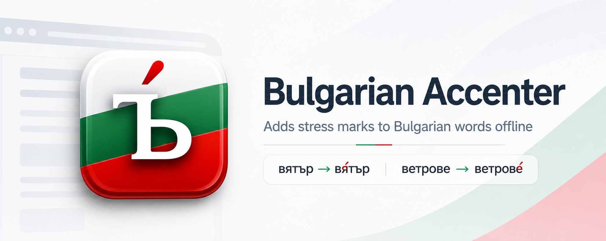
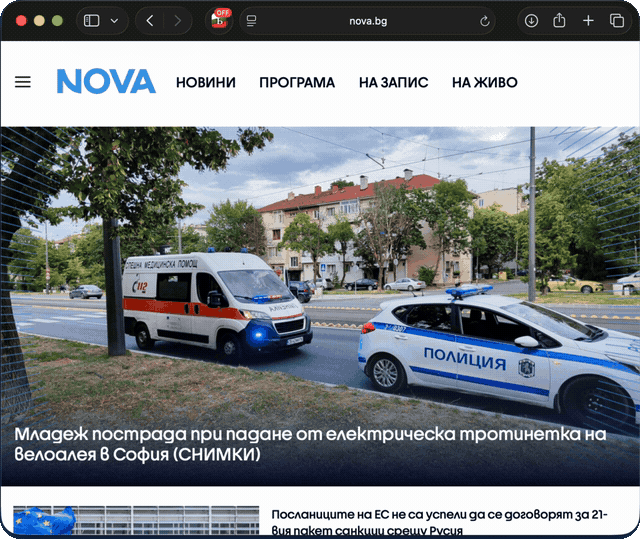

<p align="center">
  
</p>

<p align="center">
  <a href="https://github.com/noomorph/bulgarian-accenter/actions/workflows/ci.yml"></a>
  <a href="LICENSE"></a>
  <a href="NOTICE"></a>
  
  
</p>

# Bulgarian Accenter

Learning Bulgarian means learning where the stress falls, and written Bulgarian simply does not
tell you. `вятър` or `вятъ̀р`? `ветрове` or `ветровѐ`? The word on the page gives you nothing.

This extension puts the mark back:

> **вятър** → **вя̀тър** · **ветрове** → **ветровѐ**

It works on any page, **entirely offline**, from a dictionary of **404,971 word forms** bundled
inside the extension. There is no server. It makes **zero network requests** — not "anonymised"
ones, not "only for analytics": zero.

## Install

- **Chrome** — [Chrome Web Store][chrome-store]
- **Firefox** — [Firefox Add-ons][firefox-addons]
- **Safari (iOS)** — not on the App Store, but you can sideload it onto your own iPhone via Xcode.
  See [docs/SAFARI-IOS.md](docs/SAFARI-IOS.md).

Or to run from source:

```sh
npm ci
npm run dict:fetch   # the dictionary is generated, not in the repo — this pulls it (3 MB, hash-verified)
npm run build
```

- **Chrome** — `chrome://extensions` → Developer mode → _Load unpacked_ → `dist/chrome`
- **Firefox** — `about:debugging` → _Load Temporary Add-on_ → `dist/firefox/manifest.json`

Open [bg.wikipedia.org](https://bg.wikipedia.org) and click the toolbar icon.

## How to use it

Click the icon to toggle accents on the current tab. The badge shows `ON` or `OFF`.

<p align="center">
  
</p>

On a page with no Bulgarian, the badge stays **empty** — not `OFF`. That distinction is deliberate:
empty means "nothing here to accent", and it is how you tell "the extension is off" apart from
"this page has no Bulgarian markup for it to find".

## What it does

- **Finds Bulgarian by markup, not by guessing.** Text counts as Bulgarian when its _nearest_
  ancestor with a `lang` attribute says `bg`. An English island inside a Bulgarian page is skipped;
  a Bulgarian island nested back inside _that_ is picked up again.
- **Costs nothing on the other 99.9% of the web.** On a page with no Bulgarian markup it runs one
  `querySelector`, finds nothing, and stops. The 3 MB dictionary is never even fetched.
- **Doesn't break the page.** Accents are plain text spliced into the existing text nodes, so
  selection, copy-paste and layout keep working. Capitalisation survives (`Вятър` → `Вя̀тър`).
  Toggling off restores the original text exactly.
- **Doesn't invent.** A word the dictionary doesn't have is left alone rather than guessed at.

## What it gets wrong

Three things, stated plainly, because you will hit all of them.

**~0.2% of derived entries carry a wrong accent.** Roughly three quarters of the dictionary was
_derived_: the source knew the paradigm but not the stress, so we propagate a lemma's stress across
its own inflections. Held out, that is 99.5% exactly right and 0.2% wrong. It is a deliberate
trade — without it the extension accents a third of the words on a page instead of most of them,
which is the entire point of it. [Found one?][wrong] That report is genuinely useful.

**Homographs show both marks.** `въ̀лна` (wool) and `вълна̀` (wave) are one spelling. Resolving that
means understanding the sentence, which this does not, so it shows both and lets you pick. The
ambiguity is information, not dirt.

**Pages without `lang` markup are ignored** — even when the text is obviously Bulgarian. By design;
guessing the language of a page is how you end up accenting Russian.

Also: Ctrl+F stops matching accented words typed unaccented (the accent is a real character), and
text inside `<iframe>`s is not touched.

## How it works

The short version: front-coding fits 405k entries into 3.0 MB, and a resumable decoder unpacks them
in 8 ms slices, so arriving on a Bulgarian page costs about one dropped frame rather than fifteen.

The long version — the derivation pass, the four constraints that keep it honest, the learned
blacklist, why a trie was measured and rejected, and where the source data was simply wrong — is in
**[docs/ARCHITECTURE.md](docs/ARCHITECTURE.md)**. It is the interesting part.

## Privacy

No network requests, no analytics, no storage, no identifiers, no server. See [PRIVACY.md](PRIVACY.md) —
and if that page and [the code](src/) ever disagree, the code is the truth.

## Contributing

See [CONTRIBUTING.md](CONTRIBUTING.md). The most valuable thing you can send is a
**[wrong accent report][wrong]** — that is the loop that grinds the 0.2% down.

## Licence

The **code** is [MIT](LICENSE).

The **dictionary is not ours.** Its word forms descend from [БГ Офис][bgo] (© Радостин Раднев) by
way of [Речко][rechko], and БГ Офис licenses its words — not merely its code — under copyleft. It
offers a choice of three licences, and we elect the **MPL-1.1**: fixes to the dictionary flow back,
and nothing else is encumbered.

The full chain, and what is actually ours in it, is set out in **[NOTICE](NOTICE)**. Worth reading
before you reuse the data.

[bgo]: https://bgoffice.sourceforge.net/
[rechko]: https://rechnik.chitanka.info/

[wrong]: https://github.com/noomorph/bulgarian-accenter/issues/new?template=wrong_accent.yml
[chrome-store]: https://chromewebstore.google.com/detail/bulgarian-accenter/mfiiekmdocodofamnajaoeiflelipmok
[firefox-addons]: https://addons.mozilla.org/en/firefox/addon/bulgarian-accenter/
